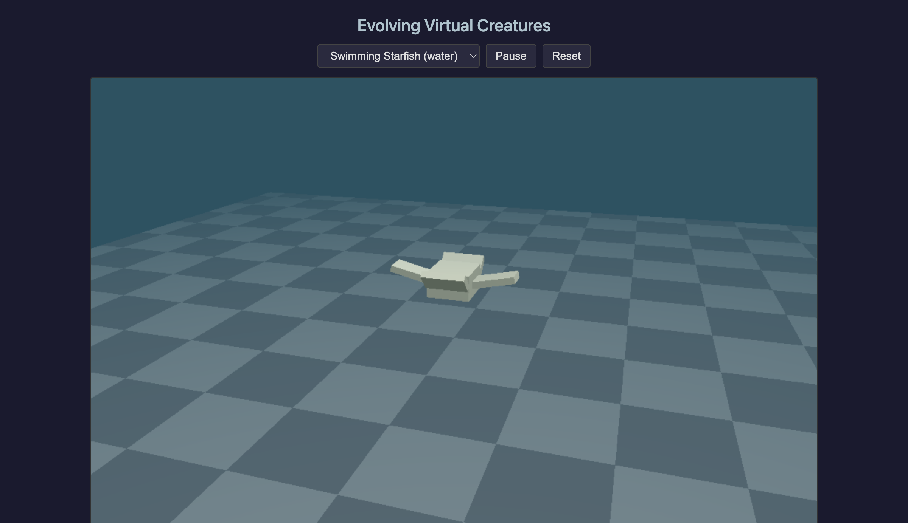

# Evolving Virtual Creatures

A recreation of Karl Sims' ["Evolving Virtual Creatures"](https://www.karlsims.com/papers/siggraph94.pdf) (SIGGRAPH 1994) in Rust + WebGPU.

Creatures are built from directed graphs of 3D rectangular solids connected by joints. Both their morphology (body plan) and neural control systems are co-evolved using genetic algorithms. Fitness is evaluated via physics simulation — creatures that swim faster toward a target survive and reproduce.



## Architecture

```
karl-sims-recreated/
├── core/       # Physics, genetics, brain, simulation (Rust, compiles to native + WASM)
├── server/     # Evolution server with SQLite, REST API, WebSocket (Rust, tokio + axum)
├── web/        # wgpu WebGPU renderer + WASM bindings (Rust → WASM)
└── frontend/   # React + TypeScript dashboard UI
```

**Core** compiles to both native (for server-side fitness evaluation) and WASM (for browser rendering). All math uses `glam` with `scalar-math` for cross-platform floating-point determinism.

## Prerequisites

- [Rust](https://rustup.rs/) (1.85+, edition 2024)
- [wasm-pack](https://rustwasm.github.io/wasm-pack/installer/) (0.14+)
- [Node.js](https://nodejs.org/) (20+)
- WASM target: `rustup target add wasm32-unknown-unknown`

## Quick Start

### Browser viewer (no server)

```bash
./dev.sh
```

Opens the 3D viewer at `http://localhost:5173` with demo scenes: starfish, hinged pair, universal/spherical joints, swimming starfish (water physics), random creature (brain-driven), and mini evolution (in-browser).

### Server-side evolution

**1. Start the server:**

```bash
cargo run --release -p karl-sims-server
```

Starts 8 parallel workers + HTTP server on `http://localhost:3000`.

**2. Start an evolution:**

```bash
curl -X POST http://localhost:3000/api/evolutions \
  -H 'Content-Type: application/json' \
  -d '{"population_size": 100}'
```

**3. Monitor progress:**

```bash
# Check status
curl http://localhost:3000/api/evolutions/1

# Get best creatures
curl http://localhost:3000/api/evolutions/1/best

# Stop evolution
curl -X POST http://localhost:3000/api/evolutions/1/stop
```

Or open the frontend dashboard (run `./dev.sh` in another terminal) for a visual UI with live fitness charts.

## API

| Method | Endpoint | Description |
|--------|----------|-------------|
| `GET` | `/api/evolutions` | List all evolution runs |
| `POST` | `/api/evolutions` | Start a new evolution |
| `GET` | `/api/evolutions/:id` | Get evolution status |
| `GET` | `/api/evolutions/:id/best` | Get top 10 creatures |
| `POST` | `/api/evolutions/:id/stop` | Stop a running evolution |
| `WS` | `/api/live` | WebSocket stream of generation stats |

## How It Works

### Genotype

A directed graph where nodes describe rigid body parts (dimensions, joint type, neural circuit) and edges describe connections (attachment face, scale, reflection). The graph can be recursive — a node connecting to itself produces repeated limbs.

### Phenotype Development

The graph is traversed from the root node, creating 3D bodies connected by joints. Each node's local neural graph is instantiated per body part. Seven joint types: rigid, revolute, twist, universal, bend-twist, twist-bend, spherical.

### Neural Brain

A dataflow graph evaluated twice per physics timestep. Six neuron functions: sum, product, sigmoid, sin, oscillate-wave (time-varying), memory. Inputs come from joint angle sensors and photosensors (for light following). Outputs drive joint torques, clamped by cross-sectional area.

### Physics Engine

Custom deterministic engine (no Rapier):

- **Featherstone's O(N) Articulated Body Algorithm** with floating-base support for free-swimming creatures
- **RK4-Fehlberg** adaptive integration (4th order, deterministic step adaptation)
- **Viscous water drag** — per-face force opposing normal velocity, proportional to area
- **OBB collision detection** — AABB broad phase + 15-axis SAT narrow phase, penalty spring response

### Genetic Algorithm

- **Population**: 300 (configurable), 1/5 survival ratio
- **Reproduction**: 40% asexual (copy + mutate), 30% crossover, 30% grafting
- **Mutation**: 5 operators — node parameter perturbation, random node addition, connection mutation, connection add/remove, garbage collection
- **Selection**: roulette wheel weighted by fitness

### Fitness

- **Swimming speed**: distance traveled through water per unit time, with anti-circling and continuing-movement bonuses
- **Following**: average speed toward a repositioning light source across multiple trials (uses photosensors)

## Project Structure

```
core/src/
├── spatial.rs       # 6D spatial algebra (SVec6, SMat6, SXform)
├── featherstone.rs  # Articulated Body Algorithm (3-pass ABA)
├── body.rs          # Rigid body (mass, inertia, face geometry)
├── joint.rs         # 7 joint types with spatial kinematics
├── world.rs         # Physics world with RK45 + water + collisions
├── genotype.rs      # Directed graph genome with nested brain graphs
├── phenotype.rs     # Grow genotype → physics world
├── brain.rs         # Neural dataflow graph evaluation
├── creature.rs      # Creature = genome + world + brain
├── mutation.rs      # 5 mutation operators
├── mating.rs        # Crossover + grafting
├── fitness.rs       # Swimming + following fitness evaluation
├── evolution.rs     # Population management + selection
├── water.rs         # Viscous drag model
├── collision.rs     # OBB detection + penalty response
└── integrator.rs    # RK4-Fehlberg adaptive integrator
```

## Tests

```bash
cargo test -p karl-sims-core
```

78 tests covering spatial algebra, Featherstone dynamics, joint kinematics, water drag, collision detection, genotype generation, phenotype development, brain evaluation, mutation, mating, fitness evaluation, and evolution.

## References

- Sims, K. "Evolving Virtual Creatures." SIGGRAPH 1994.
- Featherstone, R. *Rigid Body Dynamics Algorithms*. Springer, 2008.
